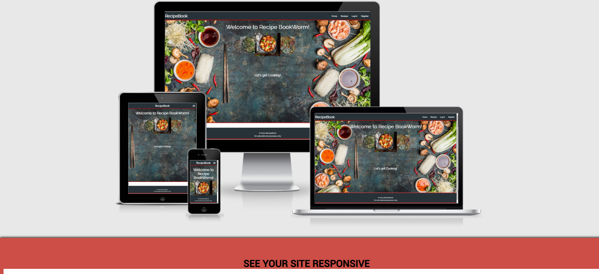
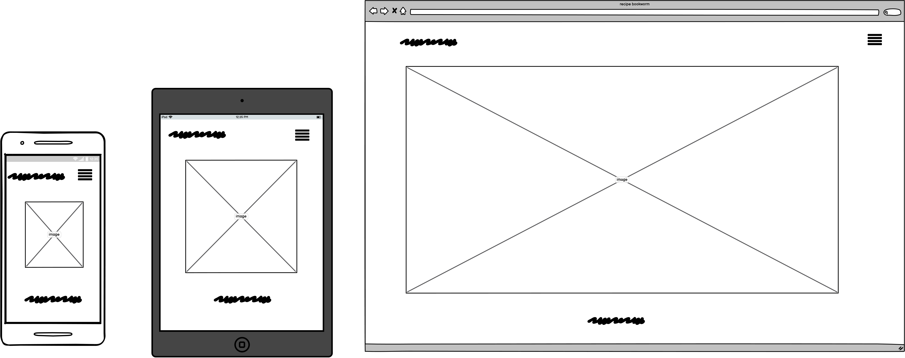
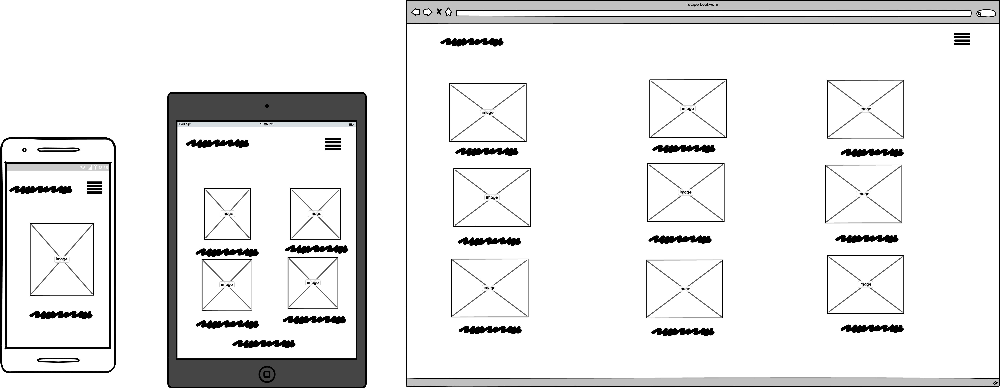
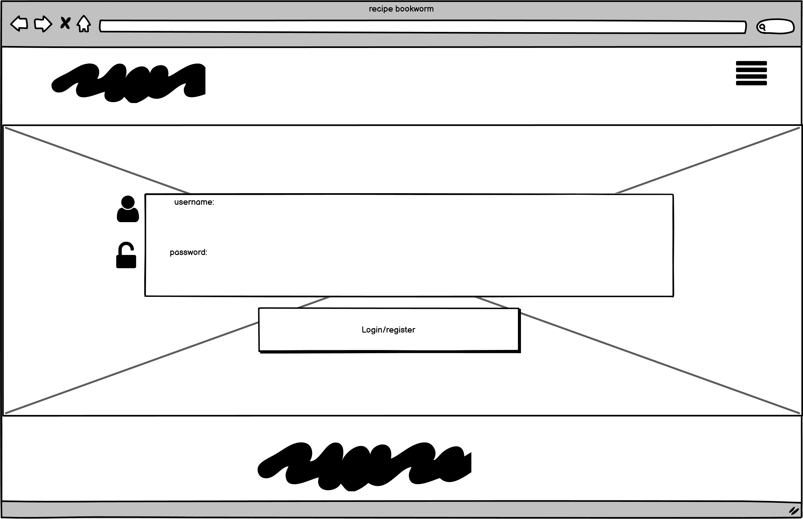
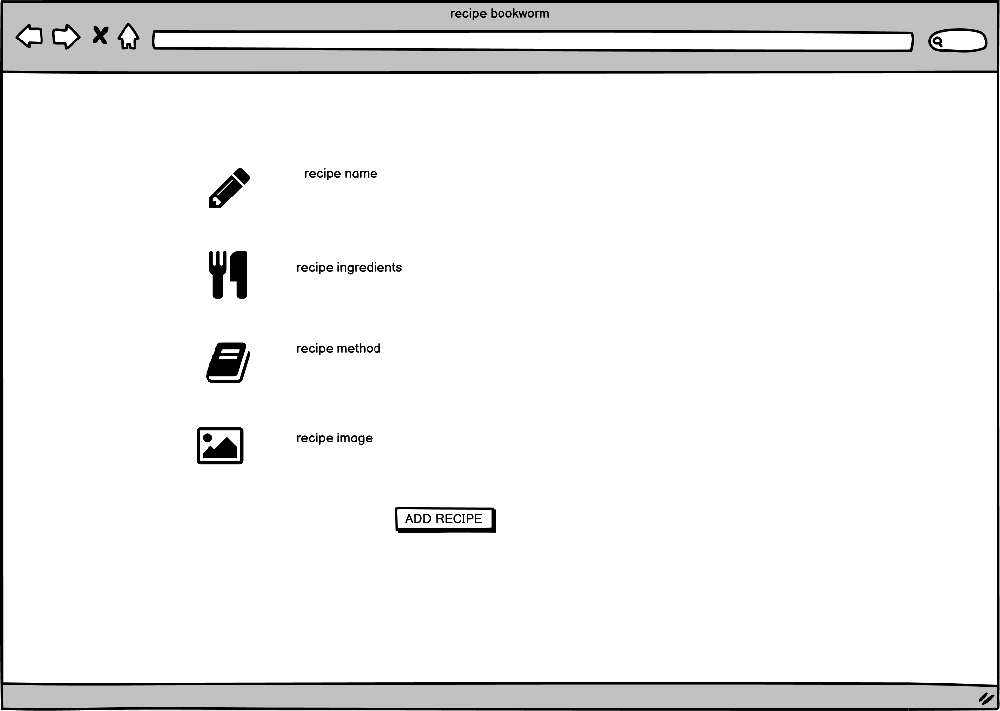

<h1>RecipeBook</h1>

[click here for the live site!](https://recipe-book-msp3.herokuapp.com/)

my goal for this project is to create a full-stack site using HTML, CSS, JavaScript, Python+Flask and MongoDB to create a website that cook enthusiasts can use to share and collect recipes from each other. users will be able to register and create an account where they are look for recipes or even add some of their own using CRUD functionality.

---

## Index 

- <a href="#ux">1. User experience (UX)</a>
  - <a href="#ux-stories">1.1 User stories</a>
  - <a href="#ux-wireframes">1.2 wireframes</a>
- <a href="#features">2. Features</a>
  - <a href="#features-existing">2.1 Existing features</a>
  - <a href="#features-future">2.2 Features left to implement in the future</a>
- <a href="#technologies">3. Technologies used</a>
- <a href="#testing">4. Testing</a>
- <a href="#deployment">5. Deployment</a>
- <a href="#credits">6. Credits</a>
- <a href="#Acknowledge">7. Acknowledge</a>
- <a href="#Acknowledge">8. Disclaimer</a>

---

## USER EXPERIENCE

The design for this site is simplistic to not overload the user, with the main focus being on finding the site to be easy to navigate for first time users who want to add recipes or find something new to try for themselves.

### USER STORIES

#### FIRST TIME VISITORS

* As a first time visitor, i want the site to be easy to understand how to navigate throughout the site.
* As a first time visitor, i want the content to be easily read and understandable.
* As a first time visitor, i want images to be clearly visible and enticing.
* As a first time visitor, i want to be able to visit the website on every device.
* As a first time visitor, i want to be able to register for an account easily.
* As a first time visitor, I want to be able to search recipes based on the name and/or ingridents, so I can find what i want easily.

#### RETURNING USER 1.1

* As a member, i want to be able to log into my profile.
* As a member, i want to have all recipes i have added to be easily locatable.
* As a member, i want to be able to log out.
* As a member, i want add my own recipes to i can add to the database for other users.
* As a member, i want be able to edit existing recipes i have added.
* As a member, i want delete recipes i have added.

## WIREFRAMES 1.2

The wireframes were designed using [Balsamiq](https://balsamiq.com/). They're accessible in the following links:

<h1>2. Features</h1>

### 2.1 Existing features 

####  General 
- Home page shows easy to navigate with a carousel of a few pictures of the recipes to come. 
- nav bar found on every page easy to use and find. 
- An attractive and simple layout with consistency.

####  register, login and logout 
- People can register a new account on the site. 
- People can login with their existing accounts. 
- People can easily log out.
- flash messages will appear if a user registers/logs in/logs out. 

####  add/edit/delete/search Recipes
- Recipes can be created, read, updated and deleted (CRUD) by the users. 
- Recipes can be sorted by category.
- People can search for recipes with the search bar. 
- Users have their own profile with access to recipes they have added. 
- Recipes inclued a full page with an image, method and listed ingredients.

### 2.2 Features left to implement in the future 
- add more for the add recipe page, such as how many it cooks for and the total time needed.
- Adding a favorite section to the users profile so that users can favorite a recipe and see them on their favorite page.  
- The user can delete their profile.

<h1>3. Technologies used</h1>

#### Languages used
- [HTML5](https://en.wikipedia.org/wiki/HTML5)
    - HTML5 provides the structure and the content for my project. 
- [CSS3](https://en.wikipedia.org/wiki/Cascading_Style_Sheets)
    - CSS3 provides the style of the HTML5 elements.
- [jQuery](https://jquery.com/)
    - jQuery used as the JavaScript functionality.
- [Python](https://www.python.org/)
    - Python provides the backend of the project.

#### Frameworks, libraries & Other
- [Gitpod](https://www.gitpod.io/) 
    - The GitPod is used to develop the project.
- [Git](https://git-scm.com/)
    - The Git was used for version control to commit to Git and push to GitHub.
- [GitHub](https://github.com/)
    - The GitHub is used to host the project.
- [Google Fonts](https://fonts.google.com/)
    - Google Fonts is used to provide the font roboto for all the text that is used in the project. 
- [Balsamiq](https://balsamiq.com/)
    - balsamiq is used to create the wireframes.
- [Materialize](https://materializecss.com/)
    - Materialize is used for the design framework.
- [MobgoDB](https://www.mongodb.com/1)
    - MongoDB is the fully managed cloud database service used for the project.
- [Heroku](https://dashboard.heroku.com/)
    - Heroki is the cloud platform to deploying the app.
- [Flask](https://flask.palletsprojects.com/en/1.1.x/)
    - Flask is the web framework used to provide libraries, tools and technologies for the app.
- [Jinja](https://jinja.palletsprojects.com/en/2.11.x/)
    - Jinja is used for templating Python
- [Werkzeug](https://werkzeug.palletsprojects.com/en/1.0.x/)
    - Werkzeug is used for password hashing and authentication and autohorization.

#### Testing tools used 
- [PEP8](http://pep8online.com/)
    - The PEP8 validator is used to check whether there were any errors in the Python code.
- [Chrome DevTools](https://developers.google.com/web/tools/chrome-devtools/open) is used to detect problems and test responsiveness.
- [W3C Markup Validation Service](https://validator.w3.org/)
    - The W3C Markup Validation Service is used to check whether there were any errors in the HTML5 code. 
- [W3C CSS validator](https://jigsaw.w3.org/css-validator/)
    - The W3C CSS validator is used to check whether there were any errors in the CSS3 code.
- [JShint](https://jshint.com/)
    - JShint is a JavaScript validator that is used to check whether there were any errors in the JavaScript code. 

<h1>4. Testing</h1>

The testing process can be found [here](TESTING.md).

<h1>5. Deployment</h1>

#### Requirements 
- Python3 
- Github account 
- MongoDB account 
- Heroku account

### HOW TO CLONE A REPOSITORY

If you need to make a clone:

1. Login in to [GitHub](www.github.com).
2. Fork the repository manni8436/MS3-Project using the steps above in [How To Fork a Repository](#HOW-TO-FORK-A-REPOSITORY).
3. Above the file list, click "Code".
4. Choose if you want to close using HTTPS, SSH or GitHub CLI, then click the copy button to the right.
5. Open Git Bash.
6. Change the directory to where you want your clone to go.
7. Type `git clone` and then paste the URL you copied in step 4.
8. Press Enter to create your clone.

[Back To Top](#for-the-love-of-food)

#### Clone the project 
To make a local clone, follow the following steps. 

1. Login in to [GitHub](www.github.com).
2. Fork the repository manni8436/MS3-Project using the steps above in [How To Fork a Repository](#HOW-TO-FORK-A-REPOSITORY).
3. Above the file list, click "Code".
4. Choose if you want to close using HTTPS, SSH or GitHub CLI, then click the copy button to the right.
5. Open Git Bash.
6. Change the directory to where you want your clone to go.
7. Type `git clone` and then paste the URL you copied in step 4.
8. Press Enter to create your clone.

#### Heroku Deployment  
1. Set up local workspace for Heroku 
    - create a `requirements.txt` by typing **pip3 freeze -- local > requirements.txt.** into your terminal (The file is needed for Heroku to know which filed to install.)
    - create a `Procfile` by typing **python app.py > Procfile** into your terminal(The file is needed for Heroku to know which file is needed as entry point.)
2. Login or Sign up to [Heroku](https://www.heroku.com/).
3. Deployment method 'Github'
    - Click on the **Connect to GitHub** section in the deploy tab in Heroku. 
        - Search your repository to connect with it.
        - When your repository appears click on **connect** to connect your repository with the Heroku. 
    - Go to the settings app in Heroku and go to **Config Vars**. Click on **Reveal Config Vars**.
        - Enter the variables contained in your env.py file. it should look like this: 

| Key | Value |
| ----------|--------- |
| PORT | 5000 |
| IP | 0.0.0.0 |
| MONGO_URI | USER_MONGODB_URI |
| MONGO_DBNAME | USER_MONGODB_NAME |
| SECRET_KEY | USER_SECRET_KEY |

once you push to github you can then Click on **Open app** in the right corner of your Heroku account. The app wil open and the live link is available from the address bar. 

<h1>6. Credits</h1>

#### Media and recipes

all recipes and images were taken from https://www.bbcgoodfood.com/recipes/collection/easy-recipes
background cover pictures taken from https://www.pinterest.co.uk/

#### Code

- [W3Schools: HTML Input Attributes](https://www.w3schools.com/html/html_form_attributes.asp)

- The lessons and knowledge of [Code Institute.](https://codeinstitute.net/) specifically the task manager walkthrough project
- Tutor Assistance 
- the slack community for helping with bugs in the code
- my mentor Precious Ijege. 

