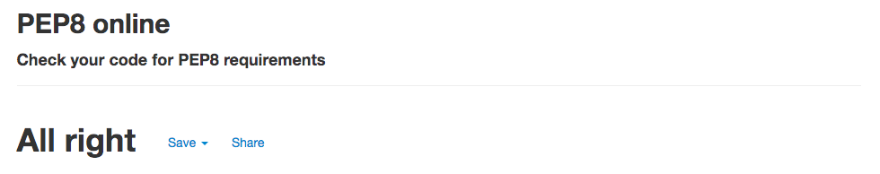
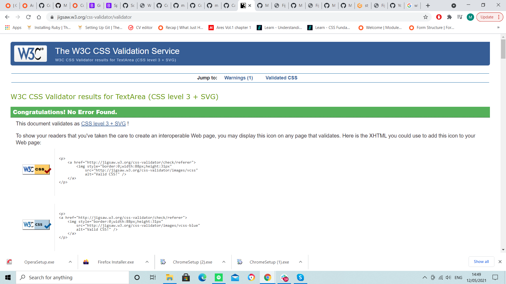

<h1>Testing</h1>

---

## Index 
- <a href="#browser">1. Browser compability</a>
- <a href="#validators">2. Code validators</a>
- <a href="#user-stories">3. Testing user stories </a>
- <a href="#bugs">4. Bugs</a>

---

## Browser compatibility
- Responsiveness on different browsers and screen sizes:

[Google Chrome](https://google.com) works as intended. 
[Mozilla Firefox](https://www.mozilla.org/en-GB/firefox/new/) works as inteaded. 
[Internet Explorer](https://www.microsoft.com/en-gb/download/internet-explorer.aspx) works as intended. 
[Opera](https://www.opera.com/) works as intended. 

manuel tested each one to ensure the website was responsive on the different browers listed via testing them all on different resoultions.

## 2. Code validators

- **[Python validator | PEP8](http://pep8online.com/):** No errors found

- **[HTML Validator](https://validator.w3.org/):** No major errors to show.
a few pop up but thats due to using flask which i have no control over.

- **[CSS Validator](https://jigsaw.w3.org/css-validator/):** No errors found.

## 3. Testing user stories 

### First-time visitor goals:
1. As a first time visitor, i want the site to be easy to understand how to navigate throughout the site.
    - a first time visitor can easily locate the navbar on the top right, which one smaller resolutions becomes a hamburger menu. through the nav bar you can easily traverse the rest of the site.
2. As a first time visitor, i want the content to be easily read and understandable.
    - a first time visitor will find the simplistic design easy and managable
3. As a first time visitor, i want images to be clearly visible and enticing.
    - a first time visitor willfind thats the pictures dont overload the page and make for eye pleaseing viewing.
4. As a first time visitor, i want to be able to visit the website on every device. 
    - a first time visitor will find that the website is responsive and accessable on all devices. 
5. As a first time visitor, i want to be able to register for an account easily.
    - a first time visitor via the narbar will find the the registration page easily locatable, and only needing to fill in two forms will be quickly able to register to the site. 
6. As a first time visitor, I want to be able to search recipes based on the name and/or ingridents, so I can find what i want easily.
    - a first time visitor will be able to use the search bar on the recipes page to easily type in the name of the dish or ingredients they wish to search the database for.

### Site member goals
1. As a member, i want to be able to log into my profile.
    -  a member with have their own profile page.
2. As a member, i want to have all recipes i have added to be easily locatable.
    - a member will have all the recipes they have added to the database shown on their profile page.
3. As a member, i want to be able to log out and in when i want.
    - a member  will be able to log out/in via the nav bar
4. As a member, i want add my own recipes to i can add to the database for other users.
    - a member will have access to the add recipes page where they can easily add new recipes to the database. 
5. As a member, i want be able to edit existing recipes i have added. 
    - a member on their profile page will have the option to edit any recipes they have added.
6. As a member, i want be able to delete existing recipes i have added. 
    - a member on their profile page will have the option to delete any recipes they have added.

    

## 4.1 Bugs | Solved
1. A bug was found trying to delete recipes where it wouldnt delete the recipe selected but the first recipe in the for loop after i had added the Are you sure? modal to the code.
  -  this was fixed by added the `{{ loop.index }}` to the modal #id.
2. when editing the file would come back as an array for the method and ingredients.
  -  `for line in recipe.recipe_method %}{{ line }}&#10;` this code fixed the problem, and had it showing as intended

## 4.2 Bugs left to solve
1. for the carousel on the home page, original i wanted it to show a random 5 recipes choosen from the database, however i couldnt get it to loop through and be visible, so i have just added 5 pictures to the carousel.
2. incase the user hasnt added an image to the add recipe file, it is to show a picture of a man kneading dough, this works on the recipe page but on the users profile it doesnt, its the exact same code and should work but it cant seem to find the image.